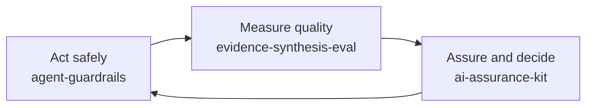

# Ugur Tuna

### I build AI systems, and the controls that make them safe to use.

AI technology and governance lead in the UK public sector. Hands-on engineer with a background in clinical genomics data at national scale. Cambridge, UK.

[ugurtuna.com](https://ugurtuna.com) · [Portfolio and writing](https://dsugurtuna.github.io)

---

**Now.** AI and digital transformation lead in the UK public sector. I lead an organisation-wide AI and automation programme: the governance and assurance that let people use AI with confidence, workflow pilots built hands-on with technical colleagues, and the skills staff need to use AI well.

**Before.** At the University of Cambridge, working on the NIHR BioResource, I ran end-to-end genomic data provisioning for one of the UK's largest national research cohorts: HLA imputation across 50,000+ samples, recall-by-genotype studies, secure data releases and GDPR subject access requests.

**The thread.** I have built data systems where one wrong row reaches a patient study, and I now work where AI meets public accountability. In both, I care about the same thing: evidence you can check.

---

## Building in the open

Three connected projects, one question: *how do you get real value from AI without losing control of it?*

| Project | The question it answers | Built with |
|---|---|---|
| **[evidence-synthesis-eval](https://github.com/dsugurtuna/evidence-synthesis-eval)** | Does an AI summary of the evidence say what the sources say? What did it miss, and what did checking it cost? | Python · [Inspect](https://inspect.aisi.org.uk/) · deterministic and model-graded scorers · blinded human review with Cohen's kappa |
| **[agent-guardrails](https://github.com/dsugurtuna/agent-guardrails)** | How do you let an AI agent act without it sending the wrong thing, twice, to the wrong people? | Python · SQLite approval queue · hash-chained audit log · Claude tool use · OWASP LLM Top 10 mapping |
| **[ai-assurance-kit](https://github.com/dsugurtuna/ai-assurance-kit)** | How can a team do proportionate AI assurance in an afternoon rather than a quarter? | Python · Pydantic · JSON Schema · Jinja2 · NIST AI RMF crosswalk |

Each one is tested offline in CI, explains its design decisions in `docs/WHY.md`, and says plainly what it has not been verified against.

## How I work

- **Usage is not quality.** Adoption figures show who clicked, not whether the output was right.
- **A second model is a critic, not a verifier.** Models share blind spots, so their agreement is not evidence.
- **Permission to build is not permission to deploy.** Connecting data, sharing a tool and letting it act are separate decisions.
- **Fix the data before adding an agent.** Often a better template or ordinary automation is the right answer.
- **Count all the effort.** Checking and correction time are part of the cost of AI.
- **Show what is uncertain.** Say what has not been verified, every time.

## Track record

At the University of Cambridge (NIHR BioResource):

- Processed **50,000+ samples** across HLA imputation batches, with automated strand-conflict resolution
- Delivered genomic cohorts of **10,000+ samples** with cryptographic verification
- Ran secure cloud transfers of **hundreds of gigabytes** into trusted research environments
- Harmonised clinical data from **several NHS Trust** formats into the OMOP common data model
- Led a team of **6 junior data scientists** in genomic data processing and secure data handling
- Enabled research across **10+ disease areas**, including rare diseases, IBD, neurodegeneration and immunology
- Handled **GDPR subject access requests** that returned clinical genomic data for patient care decisions

## Portfolio

### Clinical genomics and biobank data

Generalised versions of tooling from my NIHR BioResource work, rebuilt as tested Python packages. Synthetic data only.

| Area | Repository | What it does |
|---|---|---|
| HLA and genotyping | [hla-pipeline-manager](https://github.com/dsugurtuna/hla-pipeline-manager) | Plans, verifies and deploys SNP2HLA imputation of HLA alleles across many genotyping batches |
| | [hla-imputation-analyst](https://github.com/dsugurtuna/hla-imputation-analyst) | Health checks for SNP2HLA and Beagle imputation runs: missing outputs, log errors, and differences from a run that worked |
| | [hla-variant-investigator](https://github.com/dsugurtuna/hla-variant-investigator) | After imputation: who carries an HLA allele, whether the marker is in every sub-batch, and how well it was imputed |
| | [apoe-genotyping-toolkit](https://github.com/dsugurtuna/apoe-genotyping-toolkit) | Calls APOE genotypes from rs429358 and rs7412, estimates study feasibility and builds balanced recall lists |
| Data preparation and QC | [gwas-data-preparation](https://github.com/dsugurtuna/gwas-data-preparation) | Merges genotyping batches with explicit strand checks, applies standard GWAS QC from PLINK 1.9 reports, and converts to VCF safely |
| | [genomic-qc-toolkit](https://github.com/dsugurtuna/genomic-qc-toolkit) | Applies sample and variant QC thresholds to VerifyBamID, PLINK and mosdepth metrics, with cross-platform concordance |
| | [vcf-plink-converter](https://github.com/dsugurtuna/vcf-plink-converter) | Converts between VCF and PLINK filesets with PLINK 1.9 without losing sample IDs or reference alleles |
| | [ld-linkage-mapper](https://github.com/dsugurtuna/ld-linkage-mapper) | Finds LD proxies for variants not on the array, and maps which participants have data through a proxy |
| | [snp-feasibility-checker](https://github.com/dsugurtuna/snp-feasibility-checker) | Checks which arrays carry target SNPs and how many carriers to expect under Hardy-Weinberg equilibrium |
| Cohorts and recall | [biobank-variant-explorer](https://github.com/dsugurtuna/biobank-variant-explorer) | Checks which arrays and batches in a PLINK data store contain given variants, by rsID or position |
| | [clinical-cohort-selector](https://github.com/dsugurtuna/clinical-cohort-selector) | Builds genotype-balanced, age-matched recall lists and shows what each exclusion costs |
| | [recall-study-generator](https://github.com/dsugurtuna/recall-study-generator) | Selects participants into genotype groups for recall-by-genotype studies, balanced on sex and age, with blinded lists |
| Governance and secure delivery | [genomic-cohort-delivery-pipeline](https://github.com/dsugurtuna/genomic-cohort-delivery-pipeline) | Assembles multi-batch PLINK cohorts: exclusions, merging, allele conflicts, a checksum manifest and verified staging |
| | [biobank-data-release-manager](https://github.com/dsugurtuna/biobank-data-release-manager) | Releases genotype data to approved projects: safe SQL from sample lists, bcftools extraction and result checks |
| | [secure-genomic-transfer](https://github.com/dsugurtuna/secure-genomic-transfer) | Prepares genomic files to leave an environment: GnuPG encryption, a sha256sum manifest and an audit trail |
| | [biobank-sar-toolkit](https://github.com/dsugurtuna/biobank-sar-toolkit) | Helps answer subject access requests: resolves every identifier, finds each file and line, and writes a report for human review |

### Clinical AI platform

| Repository | What it does |
|---|---|
| [gut-reaction-platform](https://github.com/dsugurtuna/gut-reaction-platform) | Reference architecture for an inflammatory bowel disease research platform: rule-based clinical NLP phenotyping, a PII auditor with a mocked model call, data harmonisation services and a dashboard, with Kubernetes and Terraform definitions |

### Applied machine learning

| Repository | What it does |
|---|---|
| [retail-demand-forecasting-at-scale](https://github.com/dsugurtuna/retail-demand-forecasting-at-scale) | LightGBM forecasting for M5-style retail data: leakage-safe features, rolling-origin backtests and the M5 WRMSSE metric, checked against naive baselines on every run |
| [british-invoice-digitization](https://github.com/dsugurtuna/british-invoice-digitization) | Finds six fields on invoice images with a YOLOv5 detector, served through a small, tested FastAPI service |
| [fraud-detection-system](https://github.com/dsugurtuna/fraud-detection-system) | Ranks card transactions for fraud review by expected value lost, with CatBoost, isotonic calibration and a fixed review capacity |

## Toolkit

**AI engineering:** LLM evaluation with Inspect · model-graded scoring and judge validation · agents and tool use · Claude API · NLP with spaCy

**Machine learning:** LightGBM · CatBoost · scikit-learn · PyTorch · YOLOv5

**Data and bioinformatics:** Python · R · SQL · Bash and AWK · PLINK 1.9/2.0 · BCFtools · SNP2HLA · Beagle · OMOP

**Platform:** Docker · Kubernetes · Terraform · AWS · GitHub Actions · FastAPI

**Governance and assurance:** AI Playbook for the UK Government · Algorithmic Transparency Recording Standard · DPIAs · Magenta Book · Orange Book · AQuA Book · NIST AI RMF · OWASP Top 10 for LLM Applications

## Standards across these repositories

- Each project is a tested Python package with continuous integration, and a `docs/WHY.md` that explains its design decisions.
- READMEs describe what the code does today, including what is mocked or not yet verified.
- Original shell scripts sit in `legacy/` beside the rewrites, to show how ad-hoc tooling became maintainable software.
- No real participant data, credentials or proprietary information. Synthetic data only.
- I build with AI coding assistants and say so: commits written with Claude carry a co-author line. I review, test and own everything that is merged.

---

Personal projects built on public information and synthetic data. Not affiliated with or endorsed by any employer. Views are my own.
